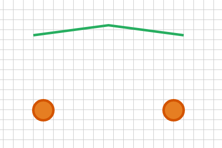
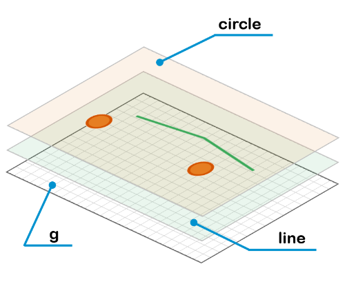
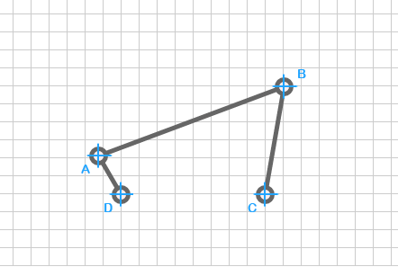
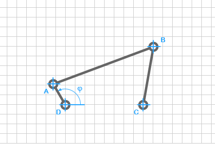

# Kurbeltrieb

## Inhalt

1. Grundsätzliches
2. Basisbefehle der g2-Bibliothek
3. Zeichnen des Kurbeltriebs mit vorgegeben Koordinaten
4. Zeichnen des Kurbeltriebs mit vorgegeben Gliedlängen
5. Animieren des Kurbeltriebs
6. Koppelzeichnen
7. Koppelkurve zeichnen
8. Koppelkurve animieren
9. Koppelkurve interaktiv
10. Momentanpol zeichnen
11. Momentanpol animieren
12. Rastpolbahn zeichnen
13. Gangpolbahn zeichnen
14. Gangpolbahn animieren

## 1. Grundsätzliches

Dieses Tutorial zeigt, wie man mit der JavaScript-Bibliothek g2 einen Kurbeltrieb, sowie Koppelkurven, Rast- und Gangpolbahnen grafisch darstellt und animiert.

Die g2-Bibiliothek ist unter [https://github.com/goessner/g2](https://github.com/goessner/g2) zu finden. Dort sind die wichtigsten Befehle in einem Wiki erklärt.

Auf die wichtigsten Befehle für unsere Animation werden wir im folgenden Kapitel eingehen und dort eine erste einfache Grafik mithilfe der g2-Bibiliothek erstellen.

## 2. Basisbefehle der g2-Bibliothek
In diesem Kapitel werden wir die Grundbefehle der g2-Bibliothek an einem einfachen Beispiel anwenden und uns so mit der g2 Bibliothek vertraut machen. Mit den Befehlen in diesem Beispiel können wir später alle nötigen Zeichnungen in diesem Tutorial erstellen.

Dazu erstellen wir zunächst eine HTML-Datei, die das Grundgerüst für all unsere Zeichnungen bereitstellen soll. Diese Datei kann für alle weiteren Grafiken als Vorlage benutzt werden. Diese Vorlage ist im tmp Ordner zur Verfügung abgelegt.

```html
<!DOCTYPE html>
<html >
  <head>
    <meta charset="UTF-8">
    <title>g2</title>
  </head>

  <body>
    <canvas id="c" width="601" height="401"></canvas> // Canvas-Elemente
    <script src='../g2.js'></script> // g2-Bibliothek

    <script>
      var ctx = document.getElementById("c").getContext("2d");

      g = g2()	// g2-Grundelement
          .cartesian() // Kartesische Koordinaten
          .pan(150,100) // Basis-Element
          .grid(); // Grid erstellen    

      g.exe(ctx);
    </script>
  </body>
</html>
```
Gehen wir hier nun auf die Befehle innerhalb des body-Elements ein. Als erstes erstellen wir ein Canvas-Element mit der  Id "c", der Breite 601px und der Höhe 401px. In dieses Canvas-Element zeichnen wir mit der g2-Bibliothek unsere Grafik. Als nächstes fügen wir die g2-Bibliothek ein und erstellen mit ```<script> </script>``` einen Bereich in dem wir mit JavaScript Befehle ausführen können. Alle weiteren Kapitel werden nur auf den Code innerhalb des JavaScript-Bereichs eingehen, da wir ansonsten nur wenn es nötig ist die Größe des Canvas-Element ändern werden.  

Innerhalb des Scriptbereichs speichern wir zunächst das Canvas-Element im Objekt ```ctx```. Als nächsten erstellen wir ein g2-Objekt und verändern die Eigenschaften des Elements mit den Methoden ```cartesian()```, ```pan(150,100)``` und ```grid()```.

| Methode        | Eigenschaft           |
| ------------- |:-------------:|
| ```cartesian()```    | Rechnet unsere Koordinaten für die SVG-Grafik um, die ihren Ursprung oben rechts hat und deren positive Achsen nach rechts und unten zeigen. Mit der Methode  ```cartesian()``` in karteischen Koordinaten zu zeichnen. |
| ```pan(150,100)```    | Verschiebt unseren Sichtbereich um 150px in x- und 100 px in y-Richtung, dies ermöglicht es unser Grafik nicht in der Ecke darzustellen. |
| ```grid()```    | Erstellt im Hintergrund ein Gitter. |

Zuletzt erstellen wir mit der Methode ```exe(ctx)``` innerhalb unseres Canvas-Element die Grafik. Vor diesem Befehl sind alle Angaben zu unserer Zeichnung nur Eigenschaften. Öffnen wir nun dieses Datei in einem Browser wird uns eine Box mit einem Gitter angezeigt.




Möchten wir nur in diese Box etwas zeichnen müssen wir den Code wie folgt ändern.

```javascript
var ctx = document.getElementById("c").getContext("2d");

line = g2(); // Linien-Objekt
circle = g2(); // Kreis-Objekt
g = g2()  // Basis-Element
  .cartesian() // Kartesische Koordinaten
  .pan(150,100) // Verschiebung des Ursprungs
  .grid() // Gitter erzeugen
  .use(line) // Nutzt Linien-Objekt
  .use(circle); // Nutzt Kreis-Objekt

line // Linien-Objekt
    .style({lw:5,ls:"#27ae60"}) // Linien-Style
    .p() // Polygonzug beginnen
    .m(0,150) // Gehe zum Punkt (0,150)
    .l(150,170) // Linie zum Punkt (150,170)
    .l(300,150) // Linie zum Punkt (300,150)
    .stroke();  // Rand zeichnen

circle // Kreis-Objekt
    .style({lw:5,ls:"#d35400",fs:"#e67e22"}) // Kreis-Style
    .cir(20,0,20)    // cir(x,y,r)
    .cir(280,0,20); // cir(x,y,r)

g.exe(ctx); // Erstelle die Grafik
```

Wir erstellen zunächst zwei weitere g2-Objekte ```line``` und ```circle```.

Diese fügen wir nun an unser g2-Objekt ```g``` an. Dies muss man sich am einfachsten wie folgt vorstellen. Jedes g2-Objekt ist ein unabhänges Objekt, diese können mit dem ```use()``` Befehl anderen Objekt hinzugefügt werden. Der Vorteil, der sich daraus ergibt, ist das jedes Objekt einzeln verändert werden kann und es möglich ist Objekte mehrfach zu nutzen.
Die Reihenfolge der ```use()```-Methoden bestimmt dabei die Reihenfolge der Objekt. Das letzte Objekt wird immer als oberstes angezeigt. Die folgende Grafik soll das Prinzip unseres Codes erklären.



Möchten wir nun einen ein Polygonzug auf das line-Objekt und zwei Kreise auf die circle-Objekt zeichen, gehen wir wie folgt vor. Für den Polygonzug ändern wir mit der ```style()```-Methode zunächst die Linenbreite ```lw``` auf 5px und die Linienfarbe ```ls``` in Grün, dabei geben wir die Farbe als HEX-Code an. Als nächsten Beginnen wir einen Polygonzug mit der ```p()```-Methode, gehen mit der Methode ```m()``` zum Startpunkt [x: 0px,y: 150px] und zeichnen dann von diesem Punkt mit der Methode ```l()``` zu erst eine Linie zum Punkt [x: 150px,y: 170px] und darauf zum Punkt [x: 300px,y: 150px]. Mit der Methode ```stroke()``` geben wir nun an, dass wir nur den Rand dieses Polygonzuges zeichnen möchten. Möchten wir stattdessen auch das innere des Polygonzuges ausfüllen müssen wir die Methode ```stroke()``` durch ```drw()``` ersetzen.

Für die beiden Kreise nutzen wir nun das ```circle```-Objekt. Wieder ändern wir die Linienbreite, die Linienfarbe und zusätzlich mit der Eigenschaft ```fs``` die Farbe des inneren des Kreises. Mit der Methode ```cir()``` erstellen nun die Kreise.

Mit diesen Befehlen haben wir nun eine einfache Grafik erstellt, die alle Elemente der g2-Bibliothek nutzt, die wir später auch für unseren Kurbeltrieb nutzen. Spielt man nun ein wenig mit den Befehlen dieses Beispiels, wird man schnell mit den Befehlen der g2-Bibliothek vertraut.

## 3. Zeichnen des Kurbeltriebs mit vorgegeben Koordinaten

Mit dem Wissen aus dem vorherigen Kapitel können wir nun ein ersten Kurbeltrieb zeichnen. Um dies zunächst zu vereinfachen nehmen wir an, dass wir die Koordinaten der Gelenke kennen. Später werden wir diese natürlich anhand der Gliedlängen berechnen.



Nehmen wir zunächst folgende Koordinaten an:

| Punkt | x-Koordinate | y-Koorindate |
| :-----: | ------------: | ------------: |
|A|-25px|43px|
|B|181px|120px|
|C|160px|0px|
|D|0px|0px|

> Koordinaten werden im Folgenden in Objekten als Vektoren bestehend aus x- und y-Koordinaten gespeichert. rA bezeichnet den Ortsvektor des Punktes A.

Mit diesen Koordinaten können wir nun wie folgt ein Kurbeltrieb mit g2 zeichnen.

```javascript
var ctx = document.getElementById("c").getContext("2d");

bar = g2(); // Kurbeltrieb
g = g2()  // Basis-Element
  .cartesian() // Kartesische Koordinaten
  .pan(150,100) // Verschiebung des Ursprungs
  .grid() // Gitter erzeugen
  .use(bar); // bar-Element nutzen

// Beispielkoordinaten
rA = {x:-25, y:43}; // Koordinaten Punkt A
rB = {x:181, y:120}; // Koordinaten Punkt B
rC = {x:160, y:0}; // Koordinaten Punkt C
rD = {x:0, y:0}; // Koordinaten Punkt D

bar
  .style({ls:"#666",fs:"#fee",lw:5,lj:"round"}) // Style-Eigenschaften
  .p() // Polygonzug beginnen
  .m(rD.x,rD.y) // Gehe zum Punkt D
  .l(rA.x,rA.y) // Linie zum Punkt A
  .l(rB.x,rB.y) // Linie zum Punkt B
  .l(rC.x,rC.y) // Linie zum Punkt C
  .stroke() // Rand zeichnen
  .cir(rD.x,rD.y,8) // Kreis im Punkt D
  .cir(rA.x,rA.y,8) // Kreis im Punkt A
  .cir(rB.x,rB.y,8) // Kreis im Punkt B
  .cir(rC.x,rC.y,8); // Kreis im Punkt C

g.exe(ctx); // Erstelle die Grafik
```

Auf dem vorherigen Kapitel basierend erstellen wir zunächst ein Objekt ```bar``` auf dem wir den Kurbeltrieb bestehend aus einem Polyzug und vier Kreisen an den Gelenkpunkten zeichnen und haben so mit wenigen Elementen den Kurbeltrieb gezeichnet.

## 4. Zeichnen des Kurbeltriebs mit vorgegeben Gliedlängen



Möchten wir einen Kurbeltrieb anhand der Gliedlängen und eines vorgegeben Kurbelwinkels zeichnen, müssen wir nun zuerst die Koordinaten der Gelenkpunkte berechnen. Um dies einfach zu erklären, habe ich diesen Schritt als Video auf Youtube zur Verfügung gestellt. Trotzdem möchte ich kurz die grundlegenden Schritte nennen.

Die Punkte D und C können direkt berechnet werden. Punkt D liegt im Ursprung und Punkt C ist mit der Länge von Glied d auf der Horizontalen  weit entfernt. Punkt A wird aus der Gliedlänge a und dem Winkel Phi berechnet. Die Koordinaten von Punkt B müssen nun aufwändiger berechnet werden. Wir berechnen Punkt B aus der Addition von den Vektoren rA und rb. rA kennen wir bereits um nun rb zu erhalten bestimmen wir zuerst einen Hilfsvektor von Punkt A zu Punkt C. Diesen drehen wir dann um den Punkt A auf den Vektor rb. Anschließend ändern wir die Länge des Hilfsvektors auf die Gliedlänge von b und erhalten den Gliedvektor rb. Der Ortsvektor von B ergibt sich nun aus der Addition von rA und rb. Damit kennen wir alle Koordinaten der vier Gelenkpunkte und können wie im vorherigen Kapitel das Viergelenk zeichnen.

[](http://www.youtube.com/watch?v=hoCllsp0V8o)

Der folgende Code zeigt nun wie sich diese Berechnung in JavaScript ermöglichen lässt.

```javascript
var ctx = document.getElementById("c").getContext("2d");
// Eigenschaften des Kurbeltriebs
var a=50, b=220, c=120, d=160, phi=120/180*Math.PI;
bar = g2(); // Kurbeltrieb
g = g2() // Basis-Element
  .cartesian() // Kartesische Koordinaten
  .grid() // Gitter erzeugen
  .pan(180,120) // Verschiebung des Ursprungs
  .use(bar); // bar-Element nutzen

rA = {x: a*Math.cos(phi), y: a*Math.sin(phi)}; // Berechnung des Orsvektor rA
rC = {x: d, y: 0}; // Berechnung des Orsvektor rC
rD = {x: 0, y: 0}; // Berechnung des Orsvektor rD
rAC = {x: d-rA.x, y: -rA.y};  // Berechnung des Orsvektor rAC
l = Math.hypot(rAC.x,rAC.y); // Länge von rAC
cg = (b*b+l*l-c*c)/(2*b*l); // cos gamma
sg = Math.sqrt(1-cg*cg); // sin gamma
rAC = {x: rAC.x*cg-rAC.y*sg,
      y: rAC.x*sg+rAC.y*cg}; // Drehen von rAC
rb = {x: b/l*rAC.x,
      y: b/l*rAC.y}; // Länge von rAC auf b normieren
rB = {x: rA.x+rb.x, y: rA.y+rb.y}; // Punkt rB = rA+rb

bar
  .style({ls:"#666",fs:"#fee",lw:5,lj:"round"}) // Style-Eigenschaften
  .p() // Polygonzug beginnen
  .m(rD.x,rD.y) // Gehe zum Punkt D
  .l(rA.x,rA.y) // Linie zum Punkt A
  .l(rB.x,rB.y) // Linie zum Punkt B
  .l(rC.x,rC.y) // Linie zum Punkt C
  .stroke() // Rand zeichnen
  .cir(rD.x,rD.y,8) // Kreis im Punkt D
  .cir(rA.x,rA.y,8) // Kreis im Punkt A
  .cir(rB.x,rB.y,8) // Kreis im Punkt B
  .cir(rC.x,rC.y,8); // Kreis im Punkt C

g.exe(ctx); // Erstelle die Grafik
```


## 5. Animieren des Kurbeltriebs


Möchten wir nun den Kurbeltrieb animieren, müssen wir Zeichungsablauf des Kurbeltriebs als Funktion aufrufbar machen. Wir ändern unseren Code wie folgt.

```javascript
// Eigenschaften des Kurbeltriebs
var a=50, b=220, c=120, d=180, phi=0, n=0.25;
```
Wir führen die zusätzliche Variable ```n``` ein, mit der wir die Drehzahl der Kurbel in 1/s angeben.

```javascript
function render(time) {
  t = time / 1000; // Zeit in Sek.
  phi = 2*Math.PI*t*n
  rA = {x: a*Math.cos(phi), y: a*Math.sin(phi)}; // Berechnung des Orsvektor rA
  rC = {x: d, y: 0}; // Berechnung des Orsvektor rC
  rD = {x: 0, y: 0}; // Berechnung des Orsvektor rD
  rAC = {x: d-rA.x, y: -rA.y};  // Berechnung des Orsvektor rAC
  l = Math.hypot(rAC.x,rAC.y); // Länge von rAC
  cg = (b*b+l*l-c*c)/(2*b*l); // cos gamma
  sg = Math.sqrt(1-cg*cg); // sin gamma
  rAC = {x: rAC.x*cg-rAC.y*sg,
        y: rAC.x*sg+rAC.y*cg}; // Drehen von rAC
  rb = {x: b/l*rAC.x,
        y: b/l*rAC.y}; // Länge von rAC auf b normieren
  rB = {x: rA.x+rb.x, y: rA.y+rb.y}; // Punkt rB = rA+rb

  bar
    .del() // Lösche vorherige Grafik
    .style({ls:"#666",fs:"#fee",lw:5,lj:"round"}) // Style-Eigenschaften
    .p() // Polygonzug beginnen
    .m(rD.x,rD.y) // Gehe zum Punkt D
    .l(rA.x,rA.y) // Linie zum Punkt A
    .l(rB.x,rB.y) // Linie zum Punkt B
    .l(rC.x,rC.y) // Linie zum Punkt C
    .stroke() // Rand zeichnen
    .cir(rD.x,rD.y,8) // Kreis im Punkt D
    .cir(rA.x,rA.y,8) // Kreis im Punkt A
    .cir(rB.x,rB.y,8) // Kreis im Punkt B
    .cir(rC.x,rC.y,8); // Kreis im Punkt C

  g.exe(ctx); // Erstelle die Grafik

  requestAnimationFrame(render); // render-Funktion neu aufrufen
}

requestAnimationFrame(render); // render-Funktion aufrufen
```
Als nächstes erstellen wir die Funktion ```render(time)```. Diese Funktion rufen wir später mit der JavaScript Funktion ```requestAnimationFrame(render)``` auf.

```requestAnimationFrame(render)```: Die ```requestAnimationFrame()```-Methode ist eine JavaScript-Methode, die speziell für Animationen mit JS entwickelt wurde. Sie bietet zwei Vorteile. Wird eine Funktion mit dieser Methode aufgerufen, übergibt diese als ersten Parameter der Funktion die aktuelle Laufzeit in Millisekunden. Zudem sorgt der Browser dafür, dass die Funktion nicht öfter aufgerufen wird, als der Browser das Bild neu zeichnen kann und wir sparen Ressourcen.

Als nächstes Rechnen wir innerhalb der ```render(time)```-Funktion die Laufzeit, die an die Variable time übergeben wird, in Sekunden um und speichern diese in die Variable t. Mit der Zeit in Sekunden, können wir nun den Winkel phi berechen. ```phi = 2*Math.PI*t*n;```

Die Zeichnung des Kurbeltriebs unterscheidet sich nun nur darin, dass wir bevor wird anfangen die Zeichnung zu erstellen, die alte Zeichnung mit der Methode ```del()``` löschen.

Als letzten Schritt rufen wir innerhalb der Funktion erneut die ```requestAnimationFrame(render);```-Methode auf. Dies erzeugt uns nun die Animation, da die Funktion sich immer wieder selbst aufruft.


## 6. Koppel zeichnen


Um nun einen wirklichen ersten Nutzen zu erhalten möchten wir in diesem Kapitel uns die Koppelkurve eines Punktes anzeigen lassen. In der Getriebelehre möchte man so bestimmte Bewegungen herstellen.

Für die Koppelkurve müssen wir zunächst unsere Koppel um den Koppelpunkt erweitern. Anschließend werden wir im nächsten Kapitel darauf aufbauend die Koppelkurve zeichnen.


Wir erweitern unsere Koppel um 2 Parameter. Diese Parameter nennen wir ```pb``` für die Verschiebung des  neuen Koppelpunktes in der Breite und ```ph``` für die Verschiebung des Koppelpunktes in der Höhe in Bezug auf Glied b. Die Abblidung zeigt diese Parameter in der Grafik.

Um die Koppel zu erweitern benötigen wir nun eine senkrechte Linie vom Glied b zum Punkt P und einen Kreis im Punkt P. Die mathematischen Schritte erkläre ich dazu in folgendem Video.

[](http://www.youtube.com/watch?v=1fJAnVQg3TM)

Unsere Funktion ```render(time)``` müssen wir nun wie folgt ändern. Zuerst berechnen wir die Punkte BP und P. Anschließend erweitern wir unseren Kurbeltrieb um eine Linie von Punkt A über Punkt PB zu Punkt P und einen Kreis im Punkt P.

```javascript
function render(time) {
  // Berechnung der Orsvektoren
  rA = {x: a*Math.cos(phi), y: a*Math.sin(phi)}; // Berechnung des Orsvektor rA
  rC = {x: d, y: 0}; // Berechnung des Orsvektor rC
  rD = {x: 0, y: 0}; // Berechnung des Orsvektor rD
  rAC = {x: d-rA.x, y: -rA.y}; // Berechnung des Hilfsvektor rD
  lenrAC = Math.hypot(rAC.x,rAC.y);
  cg = (b*b+lenrAC*lenrAC-c*c)/(2*b*lenrAC); // cos gamma
  sg = Math.sqrt(1-cg*cg); // sin gamma
  rb = {x: b/lenrAC*(rAC.x*cg-rAC.y*sg),
    y: b/lenrAC*(rAC.x*sg+rAC.y*cg)}; // Gliedvektor von GLied b
  rB = {x: rA.x+rb.x, y: rA.y+rb.y}; // Ortsvektor zum Punkt B

  // Berechnung von Punkt P
  lenrs = Math.hypot(pb,ph);
  s = Math.atan2(ph,pb); // sigma
  cs = Math.cos(s); // cos sigma
  ss = Math.sin(s); // sin sigma
  rp = {x: lenrs/b*(rb.x*cs-rb.y*ss),
    y: lenrs/b*(rb.x*ss+rb.y*cs)}; // Berechnung von Glied p
  rbp = {x:((rb.x*rp.x+rb.y*rp.y)/(b*b))*rb.x,
         y:((rb.x*rp.x+rb.y*rp.y)/(b*b))*rb.y};
  rBP = {x:rA.x+rbp.x,y:rA.y+rbp.y};  // Ortsvektor Punkt BP
  rP = {x: rA.x+rp.x, y: rA.y+rp.y}; // Ortsvektor Punkt P


  bar
    .del() // Lösche vorherige Grafik
    .style({ls:"#666",fs:"#fee",lw:5,lj:"round"}) // Style-Eigenschaften
    .p() // Polygonzug beginnen
    .m(rD.x,rD.y) // Gehe zum Punkt D
    .l(rA.x,rA.y) // Linie zum Punkt A
    .l(rB.x,rB.y) // Linie zum Punkt B
    .l(rC.x,rC.y) // Linie zum Punkt C
    .m(rA.x,rA.y) // Gehe zum Punkt A
    .l(rBP.x,rBP.y) // Linie zum Punkt BP
    .l(rP.x,rP.y) // Linie zum Punkt P
    .stroke() // Rand zeichnen
    .cir(rD.x,rD.y,8) // Kreis im Punkt D
    .cir(rA.x,rA.y,8) // Kreis im Punkt A
    .cir(rB.x,rB.y,8) // Kreis im Punkt B
    .cir(rC.x,rC.y,8) // Kreis im Punkt C
    .cir(rP.x,rP.y,8); // Kreis im Punkt P

    g.exe(ctx) // Erstelle die Grafik

  //requestAnimationFrame(render);
}
```

## 7. Koppelkurve zeichnen


Um nun die Koppelkurve zu zeichnen gehen wir wie folgt vor. Wir berechnen zu jedem Kurbelwinkelgrad die Position der Koppel und zeichnen mit diesen Koordinaten einen Polygonzug. Um dies zu erreichen stellen wir die Berechnung der Koordinaten in einer Funktion bereit. Dies ermöglichen wir in dem wir unsere Berechnung der Gelenkpunkte in der Funktion ```calc(phi,pb,ph) { ... }``` ausführen.

Außerdem benötigen wir eine Funktion, die uns den Polygonzug zeichnet. Dazu erstellen wir die Funktion ```drwCurve(phi0,pb,ph) { ... }```. In dieser Funktion erstellen wir den Polygonzug der Koppelkurve unter Benutzung der ```calc(phi,pb,ph) { ... }```-Funktion.

```javascript
function calc(phi,pb,ph) { // Berechung der Punkte
  // Berechnung der Orsvektoren
  rA = {x: a*Math.cos(phi), y: a*Math.sin(phi)}; // Berechnung des Orsvektor rA
  rC = {x: d, y: 0}; // Berechnung des Orsvektor rC
  rD = {x: 0, y: 0}; // Berechnung des Orsvektor rD
  rAC = {x: d-rA.x, y: -rA.y}; // Berechnung des Hilfsvektor rD
  lenrAC = Math.hypot(rAC.x,rAC.y);
  cg = (b*b+lenrAC*lenrAC-c*c)/(2*b*lenrAC); // cos gamma
  sg = Math.sqrt(1-cg*cg); // sin gamma
  rb = {x: b/lenrAC*(rAC.x*cg-rAC.y*sg),
    y: b/lenrAC*(rAC.x*sg+rAC.y*cg)}; // Gliedvektor von GLied b
  rB = {x: rA.x+rb.x, y: rA.y+rb.y}; // Ortsvektor zum Punkt B

  // Berechnung von Punkt P
  lenrs = Math.hypot(pb,ph);
  s = Math.atan2(ph,pb); // sigma
  cs = Math.cos(s); // cos sigma
  ss = Math.sin(s); // sin sigma
  rp = {x: lenrs/b*(rb.x*cs-rb.y*ss),
    y: lenrs/b*(rb.x*ss+rb.y*cs)}; // Berechnung von Glied p
  rbp = {x:((rb.x*rp.x+rb.y*rp.y)/(b*b))*rb.x,
         y:((rb.x*rp.x+rb.y*rp.y)/(b*b))*rb.y};
  rBP = {x:rA.x+rbp.x,y:rA.y+rbp.y};  // Ortsvektor Punkt BP
  rP = {x: rA.x+rp.x, y: rA.y+rp.y}; // Ortsvektor Punkt P
}

function drwCurve(phi0,pb,ph) { // Zeichnen der Koppelkurvve
  calc(0,pb,ph); // Berchne Kurbeltrieb bei 0°
  curve.p().m(rP.x,rP.y); // Beginne Polygonzug bei 0°
  // Zeichne Polygonzug zu jedem Winkelgradstellung der Kurbel
  for (phi=0; phi<360; phi++) {
    calc(phi/180*Math.PI,pb,ph);
    curve.l(rP.x,rP.y);
  }
  curve.z().stroke(); // Zeichne render
  calc(phi0,pb,ph);  // Berchne Punkte wieder in vorgegeben Stellungs
}
```

## 8. Koppelkurve animieren


Möchten wir nun unsere Koppelkurve animieren, müssen wir zunächst den Kurbelwinkel wieder in Abhängigkeit von der Zeit in unserer ```render(time) { ... }```-Funktion berechnen und die Animation mit dem Auskommentieren von ```requestAnimationFrame(render);``` wieder starten.

## 9. Koppelkurve interaktiv


Wirklich interessant wir es nun, wenn man die Koppelkurve interaktiv verschieben kann. Dies erreichen wir nun in dem wir uns an dem interaktiven Beispiel der g2-Bibliothek orientieren. Wir erstellen zunächst Events, die ausgeführt werden, sobald die Maus mit gedrückter Taste über das Canvas ausgeführt werden. Diese Events aktiviert die Berechnung ```calcpbph(x,y) {...}``` mit der wir die Parameter des Kurbeltriebs berechnen.  

Unsere ```interactive(event) { ... }```-Funktion sieht wie folgt aus.

```javascript
// Berechnung des Koppelpunktes ins Kartesische System und der dazugehörigen Koppelparameter
function calcpbph(x,y) {
rp = {x: x-rA.x, y: y-rA.y}; // Umrechung ins kartesische System
rpbf = ((rb.x*rp.x)+(rb.y*rp.y))/
  (Math.hypot(rb.x,rb.y)*Math.hypot(rb.x,rb.y)); // Projektion auf rb
  rpb = {x: rpbf*(rb.x), y: rpbf*(rb.y)}; // Projektion horizontal auf rb
rhbf = ((-rb.y*rp.x)+(rb.x*rp.y))/
  (Math.hypot(-rb.y,rb.x)*Math.hypot(-rb.y,rb.x)); // Projektion auf rb gedreht
  rph = {x: rhbf*(-rb.y), y: rhbf*(rb.x)}; // Porjektion senkrecht auf rb

if(rpb.x>0 && rpb.y>0) // Bestimmung von pb
  pb = Math.hypot(rpb.x,rpb.y);
else if (rpb.x<0 && rpb.y<0)
  pb = -Math.hypot(rpb.x,rpb.y);

if(rph.x<0 && rph.y>0) // Bestimmung von ph
  ph = Math.hypot(rph.x,rph.y);
else if (rph.x>0 && rph.y<0)
  ph = -Math.hypot(rph.x,rph.y);
}
function onbuttondown(e) {  // Funktion beim drücken der Maustaste
 dirty = true;
}
function onbuttonup(e) {  // Funktion beim lösen der Maustaste
 dirty = false;
}

function onmove(e) { // Funktion beim Bewegen der Maus übers Canvas
    if(dirty) { // Beim gedrückter Maus ausführen
       x += (e.movementX || e.mozMovementX || e.webkitMovementX || 0); //Verschiebung in x-Richtung
       y -= (e.movementY || e.mozMovementY || e.webkitMovementY || 0);  //Verschiebung in y-Richtung
      calcpbph(x,y); // Koppelparameter bestimmen
      curve.del(); // alte Koppelkurve löschen
      render(); // Kurbeltrieb neu zeichnen
    }
}
```

```javascript
// Initialisierung der Funktion bei einer Mausaktivität
ctx.canvas.addEventListener('mousedown', onbuttondown, false);
ctx.canvas.addEventListener('mouseup', onbuttonup, false);
ctx.canvas.addEventListener("mousemove", onmove, false);

calc(phi0,pb,ph); // Kurbelpunkte berechnen
x = rP.x, y = rP.y; // x- und y-Startkoordinaten vom Koppelpunkt bestimmen
requestAnimationFrame(render); // Kurbeltrieb zeichnen
```

## 10. Momentanpol zeichnen


In der Getriebelehre hat der Momentanpol eine große Bedeutung. Um diesen Punkt mit der g2-Bibliothek zu zeichnen, benötigt es nun nicht viel. Wir nutzen dazu unseren Code aus Kapitel xxx. Wir entfernen zunächst die ```drwCurve()```-Funktion, da wir diese nun nicht mehr benötigen. Stattdessen möchten wir nun den Momentanpol in einer ```calcMoment()```-Funktion berechnen. Dazu berechnen wir den Schnittpunkt der Vektoren rA und rC. Daraus folgt, dass unsere Funktion wie folgt aufgebaut ist.

```javascript
function calcMoment() { // Berechnung des Momentanpol
  lambdaC = d/(d-rB.x+rB.y/rA.y*rA.x);
  rlC = {x: d+lambdaC*(rB.x-d), y: lambdaC*rB.y}; // Schnittpunkt
  lambdaA = lambdaC*rB.y/rA.y;
  rlA = {x: lambdaA*rA.x,y: lambdaA*rA.y}; // Schnittpunkt
}
```
Zudem erweitern wir unsere ```render(time)```-Funktion wie folgt. Um unseren Momentanpol darzustellen.
```javascript
calcMoment(); // Momentanpol berechnen

moment
    .del() // Lösche vorherige Grafik
    .style({ls:"#666",fs:"#fee",ld:[12,6],lw:3}) // Style-Eigenschaften
    .p() // Polygonzug beginnen
    .m(rA.x,rA.y) // Gege zum Punkt A
    .l(rlA.x,rlA.y) // Linie zum Schnittpunkt
    .m(rC.x,rC.y) // Gehe zum Punkt C
    .l(rlC.x,rlC.y) // Linie zum Schnittpunkt
    .stroke() // Zeichne Ränder
    .style({ls:"red",fs:"red",ld:[1],lw:0.1}) // Style-Eigenschaften
    .cir(rlC.x,rlC.y,10); // roter Kreis im Schnittpunkt
```
Mit diesen wenigen Anpassungen haben wir nun den Momentapol mit der g2-Bibliothek sichtbar gemacht.

## 11. Momentanpol animieren


Möchten wir nun den Momentanpol zeichnen, müssen wir nur wieder den Winkel innerhalb der ```render(time)```-Funktion berechnen und die Animation durch Auskommentieren von ```requestAnimationFrame(render);``` wieder starten.

## 12. Rastpolbahn zeichnen


Um nun die Rastpolbahn zu zeichnen muss man zunächst wissen woraus die Rastpolbahn besteht. Die Rastpolbahn ist die Bahn, die sich ergibt wenn wir alle Punkte die jemals Momentapol waren mit einer Linie verbinden. Um dies zu erreichen müssen wir den Code um folgende Funktion erweitern:
```javascript
function calcRast() {      // Rastpolbahn
  var u = 0;
  for (phiR=0;phiR<360;phiR+=2) { // Durchlaufen aller Winkelgradstellung in 2 Gradschritten
  calc(phiR/180*Math.PI); // Gelenkpunkte bestimmen
  lambdaC = d/(d-rB.x+rB.y/rA.y*rA.x); // Schnittpunkt berechnen
  rlR.push({x: d+lambdaC*(rB.x-d), y: lambdaC*rB.y});
  lambdaA = lambdaC*rB.y/rA.y; // Schnittpunkt berechnen
  rlA.push({x: lambdaA*rA.x, y: lambdaA*rA.y}); // Schnittpunkt
  rR.push({x: rlA[u].x, y: rlA[u].y}); // Speichern in Array
  u++;
  }
}
```
Diese Funktion berechnnet den Momentanpol zu jedem Kurbelwinkel in 2 Gradschritten und speichert die Koordinaten in das Array ```rR```.

Anschließend zeichnen wir innerhalb unserer ```render(time)```-Funktion die Rastpolbahn in dem wir innerhalb einer for-Schleife unsere Rastpolbahnpunkte aufrufen. Da unsere Rastpolbahn aus zwei Ästen besteht müssen wir von einem Unentlichkeitspunkt zum anderen keine Linie zeichnen sondern nur zum neuen Punkt wandern. Dies löst unsere if-Bedingung innerhalb der for-Schleife, die bei Entfernungen von einem zum nächsten Punkt, die größer sind als 400px keine Linie zeichnet.

```javascript
rast
    .del() // Lösche vorherige Grafik
    .style({ls:"#16a085",ld:[6,6],lw:2}) // Style-Eigenschaften
    .p() // Polygonzug beginnen
    .m(rR[0].x,rR[0].y); // Gehe zum ersten Punkt im Array rR
    rRold = {x: rR[0].x,y: rR[0].y}; // Alter Wert
    for(var u=1; u<rR.length; u++) { // Durchlaufe das ganze Array
      if(Math.hypot(rR[u].x-rRold.x,rR[u].y-rRold.y)<400) { // Wenn Abstand von Punkten größer 400 Pixel keine Linie zeichnen
        rast.l(rR[u].x,rR[u].y);
      }else {
        rast.m(rR[u].x,rR[u].y);
      }
      rRold = {x: rR[u].x,y: rR[u].y}; // Aktuellen Wert zwischenspeichern
    }
    rast.stroke(); // Rand zeichnen
```

## 13. Gangpolbahn zeichnen


Die Gangpolbahn verhält sich ähnlich wie die Rastpolbahn. Nur werden die Koordinaten des Momentanpols im Bezug auf das Glied b gespeichert. Also bewegt sich unser Koordinatensystem für die Gangpolbahn mit dem Glied b.

Möchten wir nun die Gangpolbahn mit der g2-Bibliothek zeichnen müssen wir unseren Code wie folgt erweitern.
```javascript
function calcGang() {     // Gangpolbahn
  for(var j=0; j<=360; j+=0.5) { // Durchlaufen aller Winkelgradstellung in 0.5 Gradschritten
    phiG = j/180*Math.PI;
    calc(phiG);  // Gelenkpunkte bestimmen
    calcMoment(); // Momentanpol bestimmen
    rg = {x:rlC.x-rA.x, y:rlC.y-rA.y}; // rg-Vektor vom Momentanpol zu rA
    lenrg = Math.hypot(rg.x,rg.y); // Länge des Hilfsvektors rg
    // Cosinus und Sinus von rg zu rb bestimmen
    cg = (rg.x*rb.x+rg.y*rb.y)/(Math.hypot(rg.x,rg.y)*Math.hypot(rb.x,rb.y));
    if(lambdaC>1)
      sg = Math.sqrt(1-cg*cg);
    else
      sg = -Math.sqrt(1-cg*cg);

    rgset.push({lenrg: lenrg, cg: cg, sg: sg}); // Speichern der Polarkoordinaten
  }
}
```
Diese Funktion berechnet uns die Koordinaten in Abhängigkeit zum Glied b und speichert diese als Polarkoordinaten in das Array ```rgset```.
```javascript
gang // Gangpolbahn
    .del() // Lösche vorherige Grafik
    .p() // Polygonzug beginnen
    .style({ls:"red",ld:[1],lw:2}); // Style-Eigenschaften
    rGold = {x:0,y:0} // Anfangswert
    for(var j=0;j<rgset.length;j++) { // Durchlaufe rgset
      rGP = {x: rgset[j].lenrg/b*(rb.x*rgset[j].cg-rb.y*rgset[j].sg)+rA.x,
            y: rgset[j].lenrg/b*(rb.x*rgset[j].sg+rb.y*rgset[j].cg)+rA.y};
            // Berechne Koordinaten ins kartesische System
      if(Math.hypot(rGP.x-rGold.x,rGP.y-rGold.y)<1000) {
        gang.l(rGP.x,rGP.y);
      }else {
        gang.m(rGP.x,rGP.y);
      }
      rGold = {x:rGP.x,y:rGP.x}
    }
gang.stroke();  // Rand zeichnen
```
Anschließend zeichnen wir den Polygonzug, dazu müssen wir jeden Punkt der Gangpolbahn wieder in unser Koordinatensystem umrechnen.

## 14. Gangpolbahn animieren


Möchten wir nun die Gangpolbahn animieren müssen wir nur wieder den Winkel ```phi``` in Abhängigkeit von der Zeit berechnen und die Animation durch Auskommentieren von ```requestAnimationFrame(render);``` wieder starten.

Jetzt zeigt sich sehr gut, dass die Gangpolbahn gleitfrei auf der Rastpolbahn abrollt.
